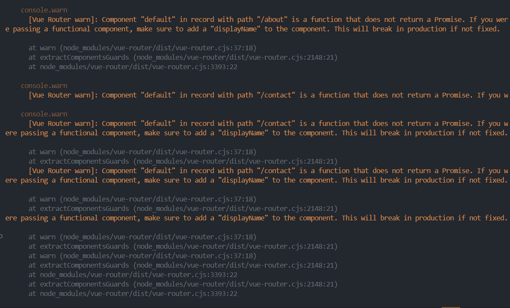

# Desafío - Pruebas Unitarias en un entorno Vue

En este desafío validaremos nuestros conocimientos de Pruebas Unitarias en un entorno Vue. Para lograrlo, necesitarás utilizar el archivo “Apoyo Desafío - Pruebas Unitarias en un entorno Vue” disponible en la plataforma.   

Consta de una aplicación sencilla, en la cual se implementan pruebas sobre una ruta definida. En esta ocasión, debemos seguir escalando esta aplicación e incorporar nuevas rutas y además aplicar snapshots para validar la estructura HTML.

## Requerimientos
1. Crea un proyecto desde 0, con Vue Router y Jest como dependencias y al menos
las siguientes vistas:

- **About**
- **Contact**

2. En el directorio de /tests/unit/views, incorpora los nuevos tests para las vistas antes mencionadas. Recuerda que al definir una nueva ruta se debe generar su componente.(Crea un test para probar vue-router en las rutas /about y /contact). [Prueba - rutas](./tests/unit/views/rutas.spec.js#1)

3- Genera una prueba que permita crear un snapshot de la estructura HTML del componente HomeView.vue. [Prueba 1](./tests/unit/views/home.spec.js#1).

4- Genera una prueba que permita crear un snapshot de la estructura HTML del componente About.vue. [Prueba 2](./tests/unit/views/about.spec.js#1).


## Nota

1. Se tuvo que agregar en el archivo jest.config.js esta linea de codigo:

```   javascript
  moduleNameMapper: {
    '^entities': 'entities'
 }
```
[Codigo agregado para que funcione el testing](./jest.config.js#3).

2. No se genero ningún diseño para los componentes ya que el desafio constaba solo de crear los dos componentes y hacer el testeo.

3. Aparece una advertencia al realizar el testeo:
 
.

Todas pasan al final.
